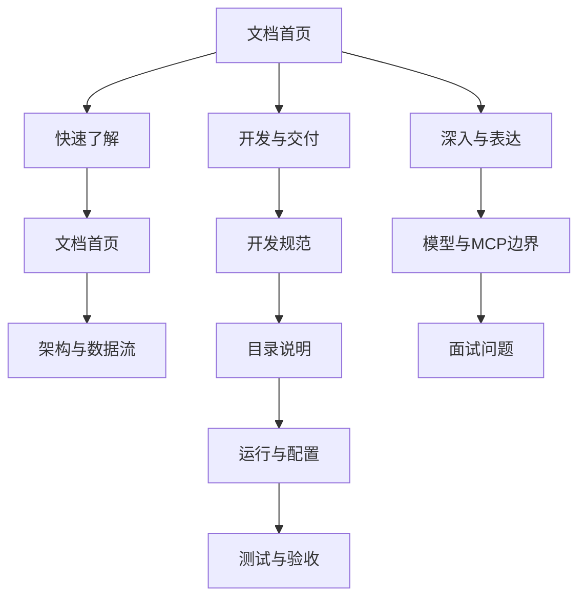

# Music AI Agent 知识库

> [!abstract] 项目定位
> 面向吉他手和音乐创作者的 Music AI Agent：自然语言经 LangChain4j 与可配置模型解析，由 Java 音乐内核生成、校验并导出 Guitar Pro 8 可使用的 MIDI 与 MusicXML；外部 MCP 客户端也可使用自己的模型直接提交结构化约束。

## 快速入口

- [[AGENTS|AI 开发规范与路线图]]
- [[PROJECT_STRUCTURE|目录与逐文件说明]]
- [[01-架构与数据流]]
- [[02-开发运行与配置]]
- [[03-测试与验收]]
- [[04-面试问题]]
- [[05-模型、内部Agent与MCP边界]]

## 当前能力

| 能力 | 状态 |
|---|---:|
| 自然语言解析为创作约束 | ✅ |
| 约束驱动单轨吉他 Riff | ✅ |
| 调性、情绪、节奏感觉、复杂度变化 | ✅ |
| 小节时值与吉他可演奏性校验 | ✅ |
| 项目、任务、版本和导出物持久化 | ✅ |
| MIDI/MusicXML、REST、SSE、MCP | ✅ |
| Vue 创作工作台 | ✅ MVP |
| 多轨、SongPlan、RiffPlan | ⏳ |

## 文档地图

阅读顺序建议：首次了解项目先看“快速了解”；准备开发或验收时进入“开发与交付”；需要讲解设计取舍时查看“深入与表达”。

> [!important]
> `Music-AI-Agent-Docs`目录本身就是Vault。密钥、密码、`.env`内容不得写入笔记。

最近更新：2026-07-17
