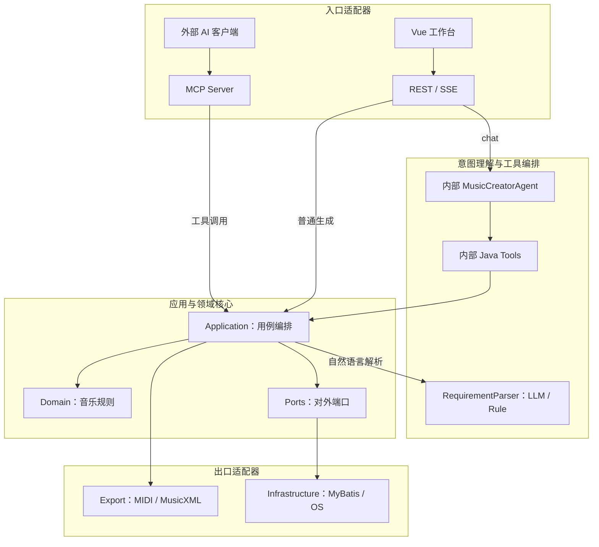
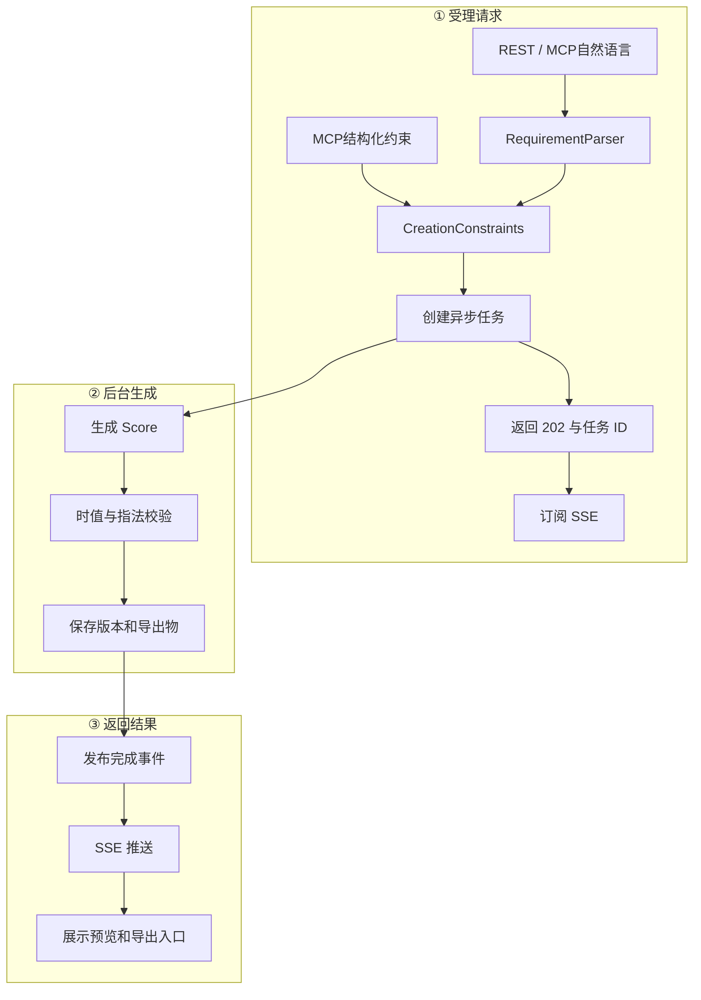

# 架构与数据流

导航：[[00-首页]] · [[PROJECT_STRUCTURE]] · [[AGENTS]]

## 逻辑分层

箭头表示实际运行时调用方向。内部 Agent 通过 `MusicCreationTools` 直接调用 Application，不通过 MCP 绕回本进程；MCP 专门服务项目外部的 Agent。Application 只依赖端口，不直接依赖 MyBatis、MySQL 或操作系统能力。

详细边界见 [[05-模型、内部Agent与MCP边界]]。

## 生成链路

自然语言路径先由服务器 `RequirementParser` 解析；结构化MCP路径直接获得约束，不调用服务器模型。两条路径都会先持久化任务，再由后台线程生成、校验、保存和导出。

## 核心边界

- Domain 保持纯 Java，不依赖 Spring、HTTP、MyBatis 或 LangChain4j。
- Agent 理解意图，但不直接写数据库或最终 MusicXML。
- 服务器模型通过通用 `llm` Profile 配置，不与 DeepSeek 名称绑定。
- MCP 的结构化约束工具允许外部模型跳过服务器 RequirementParser，避免消耗服务器模型 Key。
- `Score` 是生成、修改、校验和导出的唯一事实来源。
- Application 调用端口，Infrastructure 实现端口。
- 当前仍是单轨规则生成；多轨、和声与结构化 SongPlan 是下一阶段。
