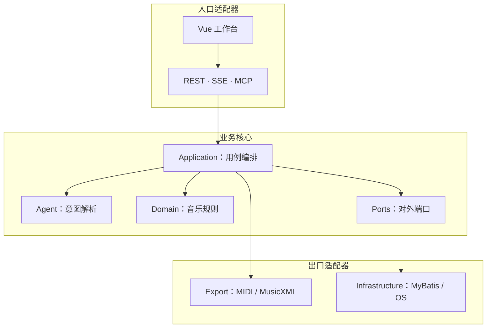
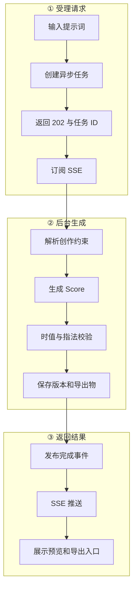

# 架构与数据流

导航：[[00-首页]] · [[PROJECT_STRUCTURE]] · [[AGENTS]]

## 逻辑分层

箭头表示运行时调用方向。Application 只依赖端口，不直接依赖 MyBatis、MySQL 或操作系统能力。

## 生成链路

第一阶段只负责受理请求并建立进度通道；解析、生成、校验和保存由后台任务完成。

## 核心边界

- Domain 保持纯 Java，不依赖 Spring、HTTP、MyBatis 或 LangChain4j。
- Agent 理解意图，但不直接写数据库或最终 MusicXML。
- `Score` 是生成、修改、校验和导出的唯一事实来源。
- Application 调用端口，Infrastructure 实现端口。
- 当前仍是单轨规则生成；多轨、和声与结构化 SongPlan 是下一阶段。
