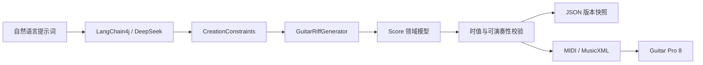

# Music AI Agent

面向吉他手和音乐创作者的音乐创作 Agent。用户使用自然语言描述调性、速度、拍号、风格和情绪，系统将其转换为结构化创作约束，由纯 Java 音乐内核生成并校验可演奏的吉他 Riff，保存项目版本，最终导出 Guitar Pro 8 可继续编辑的 MIDI 与 MusicXML。

> 当前版本是“AI 理解与编排 + 确定性规则生成”的模块化单体 MVP，不是通用音乐基础模型。DeepSeek 负责理解意图、提取约束和 Agent 工具编排；Java 领域层负责具体音乐事件生成、正确性与可演奏性。

## 核心能力

- 中英文提示词解析，以及无模型环境下的确定性规则解析器。
- 根据调性、情绪、节奏感觉、复杂度和变化种子生成单轨吉他 Riff。
- 使用精确分数表示音乐时值，校验拍号、MIDI 音高、调弦和弦品位置。
- 异步生成任务、SSE 进度事件、项目级对话记忆和 LangChain4j Tool 调用。
- 项目、任务、对话、版本快照和导出物持久化，支持小节重写与版本回滚。
- 导出标准 MIDI 与 MusicXML，并已通过 Guitar Pro 8 人工导入验证。
- 提供 REST、可选 MCP Server、Vue 3 工作台和 FastAPI WAV 基础分析服务。

## 生成链路



其中 `Score` 是生成、修改、校验和导出的唯一事实来源。大模型不直接写数据库、服务器路径或最终 MusicXML。

## 技术栈

| 模块 | 技术 |
|---|---|
| 后端 | Java 21、Spring Boot 3.5.16、Maven、MyBatis-Plus |
| AI / Agent | LangChain4j 1.17.2、DeepSeek、Chat Memory、Tool Calling |
| 协议 | REST、SSE、MCP SDK 2.0 |
| 数据 | H2（默认本地）、MySQL 8.4（Docker/`mysql` Profile） |
| 前端 | Vue 3、Vite、Element Plus、Web Audio |
| 音频服务 | Python 3.11、FastAPI |
| 测试与部署 | JUnit 5、Testcontainers、pytest、Docker Compose |

## 项目结构

```text
demo/
├── music-backend/          # Spring Boot、领域模型、Agent、持久化与导出
├── music-frontend/         # Vue 3 创作工作台与 MIDI 播放
├── music-ai-python/        # 可选 WAV 元数据、响度与 BPM 初估服务
├── Music-AI-Agent-Docs/    # Obsidian 项目知识库
├── docker/mysql/           # MySQL 首次启动建表脚本
├── scripts/                # 本地安全启动脚本
├── .run/                   # IDEA 共享运行配置
├── .local/                 # H2 数据和导出物，不提交 Git
├── docker-compose.yml
├── AGENTS.md               # 架构边界与开发规范
└── README.md
```

后端当前是单 Maven 模块，通过包结构保持边界：

```text
api → application → domain
          ↓
        agent / ports
          ↓
infrastructure / export
```

完整目录和逐文件职责见 [项目目录与逐文件说明](Music-AI-Agent-Docs/PROJECT_STRUCTURE.md)。

## 快速启动

### 环境要求

- JDK 21
- Node.js 与 pnpm
- Python 3.11（仅运行音频分析服务时需要）
- Docker Desktop（仅完整容器环境或 MySQL Testcontainers 测试需要）

### 1. 启动后端（无需模型 Key）

默认配置使用文件型 H2 和离线规则解析器，适合学习领域逻辑与本地开发：

```powershell
cd music-backend
.\mvnw.cmd spring-boot:run
```

也可以在 IDEA 中运行 `.run/MusicAiAgentApplication.run.xml`。后端地址为 `http://localhost:8080`，API 前缀为 `/api`。

### 2. 启动 DeepSeek 模式

推荐通过当前终端的环境变量传入密钥：

```powershell
$env:DEEPSEEK_API_KEY = "你的本地密钥"
$env:SPRING_PROFILES_ACTIVE = "deepseek"
cd music-backend
.\mvnw.cmd spring-boot:run
```

仓库也提供安全启动脚本，可从指定文件读取包含 `deepseek` 的密钥项，并且只注入启动的子进程：

```powershell
.\scripts\run-with-deepseek.ps1 -KeyFile "C:\path\to\key.txt"
```

不要把真实 API Key 写入源码、README、日志或 Git 提交。

### 3. 启动前端

```powershell
cd music-frontend
pnpm install
pnpm dev
```

打开 `http://localhost:5173`。开发服务器会把 `/api` 代理到 `http://localhost:8080`。

### 4. 启动可选音频分析服务

```powershell
cd music-ai-python
python -m pip install -r requirements.txt
python -m uvicorn app.main:app --reload --port 8000
```

健康检查地址为 `http://localhost:8000/health`。

## Docker Compose

复制环境变量模板并填写本机值：

```powershell
Copy-Item .env.example .env
```

当前 Compose 配置会为 API 激活 `mysql,deepseek` Profile，因此启动前必须在 `.env` 中提供有效的 `DEEPSEEK_API_KEY`：

```powershell
docker compose up -d --build
docker compose ps
docker compose logs api --tail 100
```

| 服务 | 地址/端口 |
|---|---|
| Vue 工作台 | `http://localhost:5173` |
| Java API | `http://localhost:8080` |
| FastAPI 音频分析 | `http://localhost:8000` |
| MySQL | `localhost:3306` |

MySQL 默认数据库和用户均为 `music_ai`，密码由 `.env` 中的 `MUSIC_AI_DB_PASSWORD` 决定。`docker/mysql/init.sql` 只在数据卷首次创建时执行；`docker compose down -v` 会永久删除数据库卷。

## 主要配置

| 环境变量 | 用途 | 默认行为 |
|---|---|---|
| `DEEPSEEK_API_KEY` | DeepSeek API 密钥 | 默认本地模式不需要 |
| `MUSIC_AI_ACCESS_KEY` | Web/API 访问密钥 | 空值表示关闭访问密钥校验 |
| `MUSIC_AI_DB_URL` | MySQL JDBC URL | `mysql` Profile 下指向本机 MySQL |
| `MUSIC_AI_DB_USER` | MySQL 用户 | `music_ai` |
| `MUSIC_AI_DB_PASSWORD` | MySQL 业务用户密码 | 本地 MySQL 模式必须配置 |
| `MYSQL_ROOT_PASSWORD` | Docker MySQL root 密码 | 由 Compose 使用 |
| `MUSIC_AI_MCP_ENABLED` | 启用 MCP Server | `false` |
| `MUSIC_AI_MCP_TOKEN` | MCP Bearer Token | 启用 MCP 时应配置 |
| `MUSIC_AI_EXPORT_DIR` | MIDI/MusicXML 输出目录 | `../.local/exports` |

默认 H2 数据写入根目录 `.local/data`；生产或 Docker 环境使用 MySQL，不使用 H2。

## 测试与验收

```powershell
cd music-backend
.\mvnw.cmd test

cd ..\music-frontend
pnpm build

cd ..\music-ai-python
python -m pytest tests -q
```

- 普通后端测试不依赖真实模型或网络。
- DeepSeek Live Test 只在提供 `DEEPSEEK_API_KEY` 时运行。
- MySQL Testcontainers 测试需要 Docker 可用。
- 导出测试会重新读取 MIDI、解析 MusicXML；Guitar Pro 兼容性另有人工验收样例。

## 文档

`Music-AI-Agent-Docs`本身是可直接用 Obsidian 打开的知识库：

- [知识库首页](Music-AI-Agent-Docs/00-首页.md)
- [架构与数据流](Music-AI-Agent-Docs/01-架构与数据流.md)
- [开发运行与配置](Music-AI-Agent-Docs/02-开发运行与配置.md)
- [测试与验收](Music-AI-Agent-Docs/03-测试与验收.md)
- [真实项目面试问答](Music-AI-Agent-Docs/04-面试问题.md)
- [目录与逐文件说明](Music-AI-Agent-Docs/PROJECT_STRUCTURE.md)
- [开发规范与路线图](AGENTS.md)

## 当前边界与路线

当前已经完成自然语言到单轨吉他 Riff、项目版本和 MIDI/MusicXML 的纵向闭环。以下能力仍在演进：

- 使用结构化 `SongPlan` / `RiffPlan`表达和声、段落功能、旋律轮廓和动机变奏。
- 多轨编曲、更多吉他技法事件和指法优化。
- 更完整的项目列表、乐谱预览与版本对比体验。
- 专业级音频转谱与节拍分析。

项目通过标准 MIDI/MusicXML 与 Guitar Pro 8 集成，不假设 Guitar Pro 存在公开第三方 API。

## 安全说明

- `.env`、API Key、数据库密码、访问密钥和导出数据不得提交。
- 大模型不能直接决定数据库 ID、服务器文件路径或授权操作。
- 上传文件应继续限制类型、大小和保存路径。
- 对外展示时应准确描述为“AI 解析与编排 + 约束驱动生成”，不夸大为通用音乐基础模型。
