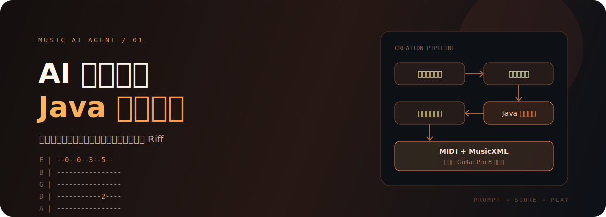
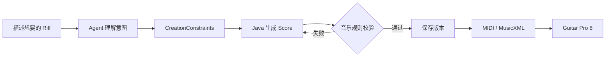
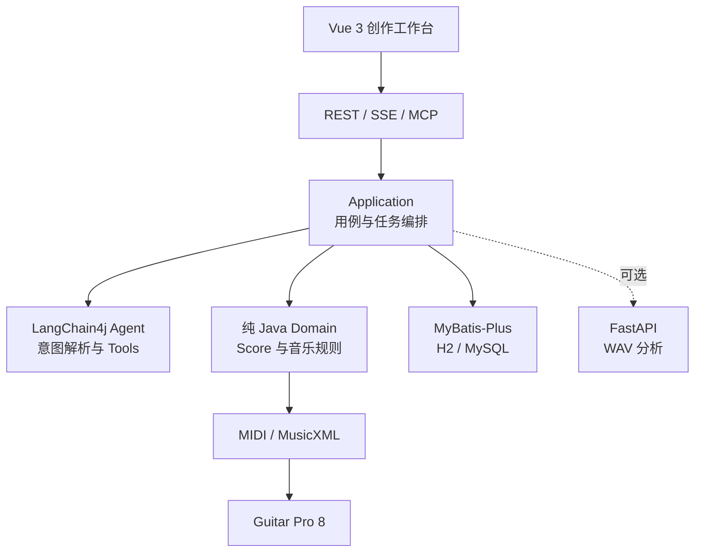

<div align="center">



# Music AI Agent

用自然语言描述一段音乐，让 Agent 把它变成**可校验、可试听、可修改、可继续编辑**的吉他 Riff。

[先看它解决什么问题](#这个项目想解决什么) · [学习收获](#你能从这里学到什么) · [运行项目](#快速开始) · [深入文档](Music-AI-Agent-Docs/00-首页.md)

</div>

---

## 这个项目想解决什么

让大模型返回一串音符并不难，难的是回答后面这些问题：一小节的时值对不对？这个音在当前调弦下能不能按出来？局部重写时，没选中的小节会不会被误改？导出的文件能不能真的被 Guitar Pro 打开？

Music AI Agent 的做法是把“理解”和“创作规则”分开：

> **DeepSeek / LangChain4j 负责听懂人话，Java 音乐内核负责把音乐写对。**

模型将“来一段 8 小节、120 BPM、E 小调、偏沉重的摇滚 Riff”解析成结构化约束；确定性的 Java 领域层再生成音乐事件，检查拍号、时值、音高和吉他弦品，最后导出 MIDI 与 MusicXML。生成结果可以在 Guitar Pro 8 中继续编辑，而不是停在聊天窗口里。

## 你能从这里学到什么

这个仓库适合用来理解一个 AI Agent 怎样跨过 Demo 阶段，真正进入有业务规则的应用。

| 你会遇到的问题 | 项目里的解法 |
| --- | --- |
| 怎样让大模型稳定输出业务参数？ | 结构化 `CreationConstraints`、Bean Validation 与规则兜底 |
| Agent 应该做什么、不该做什么？ | Tool Calling 只进入应用层；模型不碰数据库路径和最终 XML |
| 如何让 AI 结果可验证？ | 纯 Java 领域模型校验小节时值、MIDI 音高、调弦与弦品位置 |
| 长任务如何反馈进度？ | 持久化任务状态 + Spring 异步执行 + SSE 实时事件 |
| 如何安全地做局部修改？ | 小节级重写、版本快照和回滚，非目标小节保持不变 |
| Java 与 Python 怎么分工？ | Java 负责业务与符号音乐，FastAPI 负责可选音频分析 |
| Agent 如何接入更多客户端？ | REST、SSE 与可选 MCP Server 三种入口 |
| 生成文件如何验证？ | MIDI 回读、MusicXML 解析测试，以及 Guitar Pro 8 人工验收 |

如果你正在学习 **LangChain4j、Tool Calling、MCP、领域驱动设计或 AI 工程边界**，建议顺着“自然语言 → 约束 → Score → 校验 → 导出”这条链路阅读源码。

## 设计里最重要的取舍

### 1. 大模型不直接生成最终乐谱

模型擅长理解模糊意图，但不适合独自维护严格的音乐不变量。本项目让模型输出创作约束，让 `Score` 成为生成、修改、校验和导出的唯一事实来源。

### 2. 先做可演奏的纵向切片

当前重点不是“什么音乐都能生成”，而是把一条真实链路做完整：单轨吉他 Riff 能生成、能检查、能保存版本，也能进入 Guitar Pro 8。多轨编曲和复杂 SongPlan 会建立在这条链路之上。

### 3. 没有模型 Key 也能学习

默认本地模式使用确定性规则解析器和文件型 H2。即使不连接 DeepSeek，也能运行后端、阅读领域模型并验证生成与导出流程。

## 从一句话到 Guitar Pro



举个例子：

```text
生成一段 8 小节、120 BPM、E 小调、标准调弦的摇滚吉他 Riff。
情绪偏压迫，节奏要有推进感，难度不要太高。
```

约束中的调性、速度、拍号、情绪、节奏感觉、复杂度和变化种子都会参与生成。相同输入可复现，不同关键约束会产生不同的音乐事件序列。

## 已经能做什么

- 中英文创作描述解析，支持 DeepSeek 与离线规则解析器。
- 约束驱动的单轨吉他 Riff 生成，而不是固定音高模板。
- 精确分数时值、拍号、MIDI 音高、吉他调弦与弦品校验。
- 项目、对话、异步任务、版本快照和导出物持久化。
- 小节级重写与版本回滚。
- SSE 进度事件与项目级 Chat Memory。
- MIDI / MusicXML 导出，并通过 Guitar Pro 8 实际导入验证。
- Vue 3 创作工作台、MIDI 播放、REST API 与可选 MCP Server。
- FastAPI WAV 元数据、响度和 BPM 初步分析。

> [!NOTE]
> 当前是“AI 意图理解与编排 + 确定性规则生成”的模块化单体 MVP，不是通用音乐基础模型，也不承诺模仿特定音乐人的独特风格。

## 系统结构



后端采用模块化单体：物理上是一个 Maven 模块，代码中保持以下调用边界。

```text
api → application → domain
          ↓
       agent / ports
          ↓
infrastructure / export
```

Domain 保持纯 Java，不依赖 Spring、LangChain4j、MyBatis 或 HTTP。

## 技术栈

| 位置 | 使用的技术 |
| --- | --- |
| Java 后端 | Java 21、Spring Boot 3.5.16、Maven、MyBatis-Plus |
| Agent | LangChain4j 1.17.2、DeepSeek、Chat Memory、Tool Calling |
| 接口 | REST、SSE、MCP SDK 2.0 |
| 数据 | H2（默认本地）、MySQL 8.4（Docker / `mysql` Profile） |
| Web 工作台 | Vue 3、Vite、Element Plus、Web Audio |
| 音频服务 | Python 3.11、FastAPI |
| 验证与部署 | JUnit 5、Testcontainers、pytest、Docker Compose |

## 快速开始

### 最短路径：不配置模型 Key

准备 JDK 21，进入后端目录启动应用：

```powershell
cd music-backend
.\mvnw.cmd spring-boot:run
```

默认使用文件型 H2 与离线规则解析器。后端地址为 <http://localhost:8080>，API 前缀为 `/api`。

再启动 Web 工作台：

```powershell
cd music-frontend
pnpm install
pnpm dev
```

打开 <http://localhost:5173>。开发服务器会将 `/api` 代理到 Java 后端。

### 接入 DeepSeek

密钥只通过环境变量传入，不写进源码或配置文件：

```powershell
$env:DEEPSEEK_API_KEY = "你的本地密钥"
$env:SPRING_PROFILES_ACTIVE = "deepseek"
cd music-backend
.\mvnw.cmd spring-boot:run
```

仓库还提供了只向子进程注入密钥的启动脚本：

```powershell
.\scripts\run-with-deepseek.ps1 -KeyFile "C:\path\to\key.txt"
```

### Docker Compose

完整容器环境使用 MySQL 与 DeepSeek Profile，因此需要先填写 `.env`：

```powershell
Copy-Item .env.example .env
docker compose up -d --build
docker compose ps
```

| 服务 | 地址 |
| --- | --- |
| Vue 创作工作台 | <http://localhost:5173> |
| Java API | <http://localhost:8080> |
| FastAPI 音频分析 | <http://localhost:8000> |
| MySQL | `localhost:3306` |

> [!IMPORTANT]
> `.env`、DeepSeek Key、数据库密码、访问密钥和本地导出物都不应提交到 Git。

## 测试与验收

```powershell
# Java 领域、接口、导出与持久化测试
cd music-backend
.\mvnw.cmd test

# 前端生产构建
cd ..\music-frontend
pnpm build

# Python 音频分析测试
cd ..\music-ai-python
python -m pytest tests -q
```

普通 Java 测试不依赖真实模型和网络；DeepSeek Live Test 只在提供 Key 时执行；MySQL Testcontainers 测试需要 Docker。

## 项目地图

```text
demo/
├── music-backend/          # 领域模型、Agent、应用服务、持久化与导出
├── music-frontend/         # Vue 3 创作工作台与 MIDI 播放
├── music-ai-python/        # 可选 WAV 分析服务
├── Music-AI-Agent-Docs/    # 可直接用 Obsidian 打开的项目知识库
├── docker/mysql/           # MySQL 初始化脚本
├── scripts/                # 本地安全启动脚本
├── docker-compose.yml
├── AGENTS.md               # 架构边界、开发规范与路线图
└── README.md
```

## 推荐阅读顺序

1. [架构与数据流](Music-AI-Agent-Docs/01-架构与数据流.md)：先理解模型、领域层和导出的边界。
2. [目录与逐文件说明](Music-AI-Agent-Docs/PROJECT_STRUCTURE.md)：顺着一次请求找到具体代码。
3. [开发运行与配置](Music-AI-Agent-Docs/02-开发运行与配置.md)：切换 H2、MySQL 和 DeepSeek Profile。
4. [测试与验收](Music-AI-Agent-Docs/03-测试与验收.md)：理解音乐规则怎样被自动验证。
5. [真实项目面试问答](Music-AI-Agent-Docs/04-面试问题.md)：用设计取舍复盘项目。

整个 `Music-AI-Agent-Docs` 目录也可以直接作为 Obsidian Vault 打开。

## 还在继续的部分

- [ ] 用 `SongPlan` / `RiffPlan` 表达和声、段落功能与动机发展。
- [ ] 多轨编曲与更多吉他技法事件。
- [ ] 自定义调弦、难度控制和更好的指法优化。
- [ ] 更完整的项目列表、乐谱预览和版本对比。
- [ ] 专业级音频转谱、和弦与多音高识别。

项目通过标准 MIDI / MusicXML 与 Guitar Pro 8 集成，不假设 Guitar Pro 存在公开第三方 API。

## 一起把它写下去

如果你对音乐生成、吉他领域建模或 Java Agent 工程感兴趣，欢迎提交 Issue 讨论设计，也欢迎补充新的调弦规则、生成策略、导出兼容测试和前端交互。

如果这个项目给了你一点启发，可以留下一颗 Star。更欢迎你 Fork 一份，然后让它写出属于你的第一段 Riff。

---

<div align="center">

`PROMPT → CONSTRAINTS → SCORE → PLAY`

</div>
